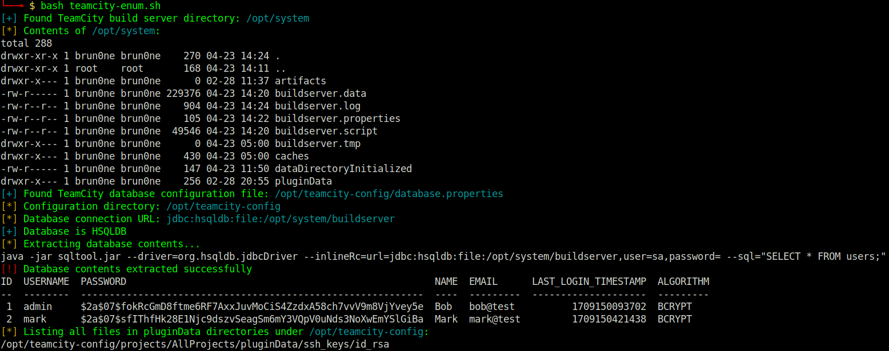

# TeamCity Post-Exploitation

This tool makes enumerating a box running [TeamCity Server](https://www.jetbrains.com/teamcity/) after successful exploitation easier.

It is meant to be **ran locally on a target machine** for example after a successful exploitation of [CVE-2023-42793](https://nvd.nist.gov/vuln/detail/CVE-2023-42793).

## Usage

```sh
$ git clone https://github.com/brun0ne/teamcity-enum
$ cd teamcity-enum
$ bash teamcity-enum.sh
```

## Features

- finds the TeamCity buildserver data
- finds the database configuration
- attempts to extract the user table from a `hsqldb` database (if used)
    - more info: https://hsqldb.org/doc/2.0/util-guide/sqltool-chapt.html
- finds and lists all files in `pluginData` directories

## Screenshots



## Credits

This tool makes use of `hsqldb.jar` and `sqltool.jar` by [hsqldb](https://hsqldb.org).
